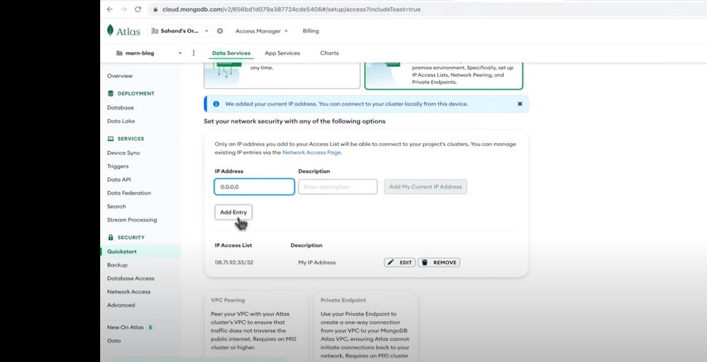

# Search List

1. React-router-dom
2. SWC compiler

# Notes

- only the admin can create post meh !

- the blog live demo : https://blog.100jsprojects.com/post/installing-react-js-with-vite-and-tailwind-css--a-quick-and-efficient-guide

- https://github.com/sahandghavidel/mern-blog

- `swc compiler` to complile js code

# To Push existed project on github

1. Create a completely empty repo
2. you will have instructions page

```bash
git remote add origin git@github.com:Abdelrahman286/Blog-MERN.git
git branch -M main
git push -u origin main
```

---

- flowbite react ---> it's like bootstrap
  - everything works fine except the plugins

# TO get the current location

```js
import { useLocation } from "react-router-dom";

const path = useLocation().pathname;
```

- we gonna use this feature to activate the active link

# Create the server

- the pack.json should be in root, for deployment purpose
- commonJs vs es6 modules
- you can change the type of module in nodejs

```js
"type" : "module"
```

# Connect to Database



add 0.0.0.0 ip ---> to access database from everywhere

# User model (Schema)

- { timestamps: true } 🔴 to save the time of creation & update

# sign up api

- error 404 ---> Bad request api

- we have to warp any database query inside try catch block to avoid the break of the server (it won't respond to any reuquests)

- we need to encrypt the passwords

```bash
npm i bcryptjs
```

# Middleware to handle errors

- mongoose model returns error if the req body data did not match the schema, so we have to wrap every query inside a try catch block

- we gonna add the error handling middleware after all routes, and if the auth route had an error we gonna call next to excute this middleware

```js
// ERROR HANDLING MIDDLEWARE
app.use((err, req, res, next) => {
  const statusCode = err.statusCode || 500;
  const message = err.message || "internal Server Error";
  res.status(statusCode).json({ success: false, message, statusCode });
});
```

# Sign in Form State

```js
const [formData, setFormData] = useState({});
const handleChange = (e) => {
  setFormData({ ...formData, [e.target.id]: e.target.value });
};
```
- vite proxy to change the api link 